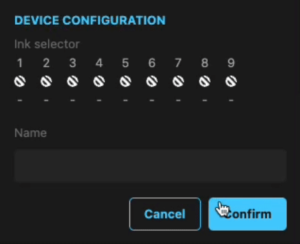

Welcome, developer! To perform this test under the best conditions, I invite you to take the time to read the contents of this `README.md`.

## Context

You're in charge of developing an ink selection feature in the device configuration. Unfortunately, a few bugs from previous development still persist. Don't hesitate to read the existing code carefully, and even refactor or adapt certain things when you think they could be simplified, improved, or there are inconsistencies in the way the code is written. The idea of this test is as much to see how you analyze what already exists, and how critical you can be, as it is to see how you write code yourself.

## How to

- Install the dependencies with `npm install`.
- Read the instructions.
- Complete the test, push your commit(s) to your forked repository.
- When you think the test is ready, you can send it in an archive `.zip` or send a GitHub/GitLab link (your repository must be public) to `[julien.bussi@caldera.com](mailto:julien.bussi@caldera.com)` and `[audrey.sebban@caldera.com](mailto:audrey.sebban@caldera.com)`.

## Instructions

- Be aware of the `TODO`, when it will be necessary, you must uncomment them.
- **Bonus:** write some unit tests when necessary.

### Device configuration

- We can create a device without a name.
- There are **4 mandatory inks** in a device: **Cyan**, **Magenta**, **Yellow**, and **Black**.
- It should be possible to create and edit an **existing or new** device, and to delete one or more **existing or new** devices.

### Ink selector

- There must always be **9 ink slots** in a device.
- When an **ink slot is empty**:
  - With a `Click`, the contextual menu for selecting an ink from the selectable inks opens.
- When an **ink slot is full**:
  - With a `Click`, the contextual menu for selecting an ink from the selectable inks opens.
  - With a `Alt + Click`, the ink slot empties.
- **Bonus:** ink slots can be dragged & dropped to be reorganized (NPM package allowed).
- **Bonus:** write unit tests for this feature.

**Expected result:**

- Selectable inks can be found in the `device-editor.vue` component, under the `SELECTABLE_INKS` constant variable.
- Placeholder icons (when the ink is empty, or when an ink can be added) are in the `/src/assets/icons/` folder.
